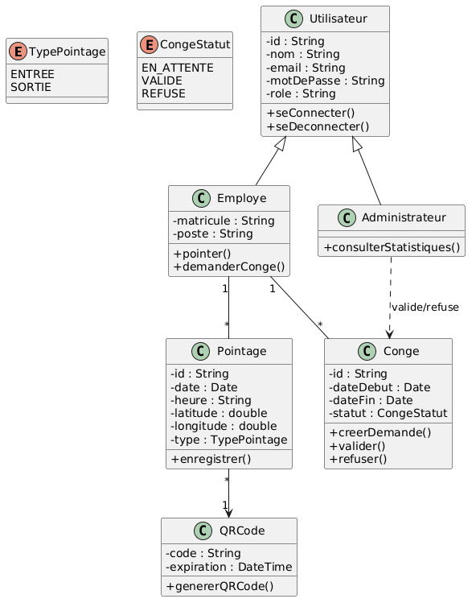
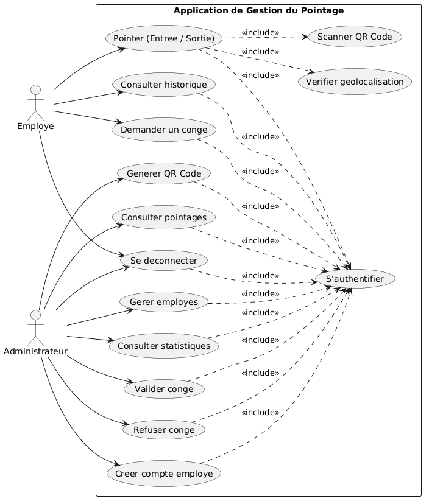

# Application de Gestion du Pointage Numerique


## Overview

**Application de Gestion du Pointage Numerique** is a web application for managing employee attendance digitally. It supports secure authentication, role-based access, QR code attendance validation, GPS verification, leave management, reporting, and an analytics dashboard.

The project is designed for a professional portfolio and school project defense, with a focus on security, traceability, responsive design, and automated quality checks.

## Key Features

- Secure authentication with email and password.
- JWT-based sessions stored in `httpOnly` cookies.
- Role-based access control for `admin` and `employee` users.
- Smart attendance tracking with GPS verification.
- QR code scanning for attendance validation.
- QR code auto-regeneration every 5 minutes to reduce fraud.
- Entry and exit tracking with a dynamic clock-in/clock-out button.
- Leave management: request, validate, refuse, and comment.
- Admin dashboard with KPIs: present employees, absent employees, late arrivals, and hours worked.
- Anomaly detection for late arrivals, early departures, and insufficient hours.
- Advanced filters by day, week, month, year, and employee.
- Export reports to Excel and PDF.
- PWA support for mobile installation.
- Mobile-first responsive design.

## Actors

### Admin

The administrator can manage employees, generate QR codes, validate or refuse leave requests, and view the global analytics dashboard.

### Employee

The employee can clock in and out using QR code scanning with GPS verification, request leave, and view personal attendance history.

## Technologies Used

The project was scanned from `package.json`, configuration files, imports, and the GitHub Actions workflow. These are the technologies currently used by the application.

### Core Application

| Technology | Version / Package | Usage in this project |
| --- | --- | --- |
| Next.js | `next@16.2.6` | Main full-stack framework. The app uses the App Router under `app/`, route handlers under `app/api/`, layouts, redirects, server APIs, and client pages. |
| React | `react@19.2.4`, `react-dom@19.2.4` | UI rendering for admin and employee dashboards, forms, QR screens, profile pages, and attendance history. |
| TypeScript | `typescript@^5` | Static typing for pages, API routes, models, auth helpers, and config files. |
| Node.js | Node 20 in CI | Runtime used by Next.js and the CI pipeline. |
| npm | `package-lock.json` | Dependency management and scripts for development, build, linting, and tests. |

### Styling and UI

| Technology | Version / Package | Usage in this project |
| --- | --- | --- |
| Tailwind CSS | `tailwindcss@^4`, `@tailwindcss/postcss` | Utility-first styling through `app/globals.css` and PostCSS. |
| shadcn/ui | `shadcn@^4.6.0`, `components.json` | UI component setup with aliases for `components`, `lib`, and `ui`. |
| Radix UI | `radix-ui@^1.4.3` | Accessible UI primitives used by components such as dialog, select, button slot, and badge slot. |
| Lucide React | `lucide-react@^1.14.0` | Icon library used across navigation, dashboards, actions, forms, and status indicators. |
| Class Variance Authority | `class-variance-authority@^0.7.1` | Variant styling for reusable UI components like buttons, badges, and alerts. |
| clsx | `clsx@^2.1.1` | Conditional class name composition. |
| tailwind-merge | `tailwind-merge@^3.5.0` | Merges Tailwind classes safely in the shared `cn()` utility. |
| tw-animate-css | `tw-animate-css@^1.4.0` | Animation utility imported in global CSS. |
| next/font | Built into Next.js | Loads Geist and Geist Mono fonts in `app/layout.tsx`. |

### Backend, Database, and Auth

| Technology | Version / Package | Usage in this project |
| --- | --- | --- |
| Next.js Route Handlers | Built into Next.js | Backend endpoints for authentication, employees, pointages, statistics, and QR token generation. |
| MongoDB | via `MONGODB_URI` | Primary database for users, attendance records, leave records, and QR tokens. |
| Mongoose | `mongoose@^9.6.1` | ODM used for `User`, `Pointage`, `Conge`, and `QRToken` schemas/models. |
| JSON Web Tokens | `jsonwebtoken@^9.0.3` | Creates and verifies authentication tokens. |
| HTTP-only cookies | `next/headers` cookies API | Stores the JWT session securely on login and removes it on logout. |
| bcryptjs | `bcryptjs@^3.0.3` | Hashes passwords during registration and verifies passwords during login. |
| UUID | `uuid@^14.0.0` | Generates unique QR attendance tokens. |
| Node DNS API | `node:dns` | Forces IPv4-first MongoDB resolution to avoid local network DNS issues. |

### Attendance, QR, and Data Visualization

| Technology | Version / Package | Usage in this project |
| --- | --- | --- |
| qrcode.react | `qrcode.react@^4.2.0` | Renders the admin QR code display as SVG. |
| html5-qrcode | `html5-qrcode@^2.3.8` | Scans QR codes from the employee scanner page. |
| Browser Geolocation API | Browser API | Captures latitude and longitude for attendance validation. |
| Recharts | `recharts@^3.8.1` | Dashboard charts for attendance and activity analytics. |
| Vercel Analytics | `@vercel/analytics@^2.0.1` | Adds analytics through `app/layout.tsx`. |

### Testing and Quality

| Technology | Version / Package | Usage in this project |
| --- | --- | --- |
| Jest | `jest@^30.4.2` | Unit test runner configured in `jest.config.ts`. |
| jest-environment-jsdom | `jest-environment-jsdom@^30.4.1` | Browser-like test environment for React and DOM tests. |
| Testing Library React | `@testing-library/react@^16.3.2` | React component testing dependency. |
| Testing Library Jest DOM | `@testing-library/jest-dom@^6.9.1` | Custom DOM matchers loaded through `jest.setup.ts`. |
| ESLint | `eslint@^9`, `eslint-config-next@16.2.6` | Linting with Next.js Core Web Vitals and TypeScript rules. |
| TypeScript compiler | `tsc --noEmit` | CI type checking without emitting build files. |

### CI/CD and Security Tooling

| Technology | Usage in this project |
| --- | --- |
| GitHub Actions | CI pipeline in `.github/workflows/security.yml`. |
| Codecov | Uploads Jest coverage reports from `coverage/lcov.info`. |
| npm audit | Scans dependencies for high-severity vulnerabilities. |
| TruffleHog | Scans the repository for verified secrets. |
| CodeQL | Static security and quality analysis for JavaScript/TypeScript. |
| SonarCloud | Code quality analysis using source folders `app`, `lib`, and `models`. |
| Lighthouse CI | Runs performance, accessibility, and SEO checks against key pages. |
| OWASP ZAP | Dynamic baseline security scan against the running app. |
| wait-on | Waits for the production server before Lighthouse and ZAP scans. |
| Vercel | Intended deployment platform for the Next.js application. |

### Installed but not currently referenced in source imports

These packages are installed in `package.json`, but the current source scan did not find direct usage in `app/`, `components/`, `lib/`, or `models/`:

| Package | Notes |
| --- | --- |
| `@tanstack/react-query` | Available for client-side data fetching/cache management, but current pages use `fetch` directly. |
| `axios` | Available HTTP client, but current source uses the native `fetch` API. |
| `jose` | Available JWT/JOSE toolkit, while current auth code uses `jsonwebtoken`. |
| `qrcode` | Available QR generation package, while current UI uses `qrcode.react`. |
| `zod` | Available schema validation library, but no current direct imports were found. |

## Architecture

```text
app/
+-- admin/
|   +-- dashboard/
|   +-- employes/
|   +-- qr-display/
|   +-- conges/
+-- employe/
|   +-- pointage/
|   +-- historique/
|   +-- conges/
+-- api/
    +-- auth/
    +-- pointage/
    +-- employes/
    +-- conges/
    +-- stats/
    +-- qrcode/
```

### Application Flow

1. Users authenticate with email and password.
2. The server creates a JWT session stored in an `httpOnly` cookie.
3. Role-based access separates admin workflows from employee workflows.
4. Employees scan a time-limited QR code and validate attendance with GPS.
5. Attendance, leave requests, statistics, and reports are managed through API routes backed by MongoDB Atlas.

## Getting Started

### Prerequisites

- Node.js
- npm
- MongoDB Atlas database

### Installation

```bash
npm install
```

### Environment Variables

Create a `.env.local` file at the project root and configure the following variables:

```env
MONGODB_URI=mongodb://localhost:27017/pfa_pointage
JWT_SECRET=votre_secret_jwt
```

For production, `MONGODB_URI` should point to the MongoDB Atlas connection string.

### Development Server

```bash
npm run dev
```

Open the application in your browser:

```text
http://localhost:3000
```

### Quality Checks

```bash
npm run lint
npx tsc --noEmit
npm run build
```

## CI/CD

The project includes a GitHub Actions CI pipeline focused on quality, security, and production readiness.

Pipeline steps:

- Install dependencies with `npm ci`.
- Run TypeScript type checking.
- Run ESLint.
- Build the application.
- Run dependency vulnerability checks with NPM Audit.
- Run secret scanning with TruffleHog.
- Run CodeQL security analysis.
- Deploy automatically on Vercel.
- Analyze code quality with SonarCloud.

## Security

Security is integrated into both the application design and the CI pipeline.

Application security:

- JWT authentication stored in `httpOnly` cookies.
- Role-based access control for admin and employee areas.
- QR code regeneration every 5 minutes to reduce attendance fraud.
- GPS verification for attendance validation.

CI security:

- NPM Audit for dependency vulnerabilities.
- CodeQL for static security analysis.
- TruffleHog for secret detection.
- SonarCloud for code quality analysis.

## Screenshots

Add screenshots of the main application screens here:

- Login page
- Admin dashboard
- Employee attendance page
- QR code display page
- Leave management page
- Attendance history page

## Conception

### Class Diagram



### Use Case Diagram



## Deployment

The application is designed to be deployed on Vercel.

Required production environment variables:

```env
MONGODB_URI=
JWT_SECRET=
```

## License

No license information has been provided for this project.
